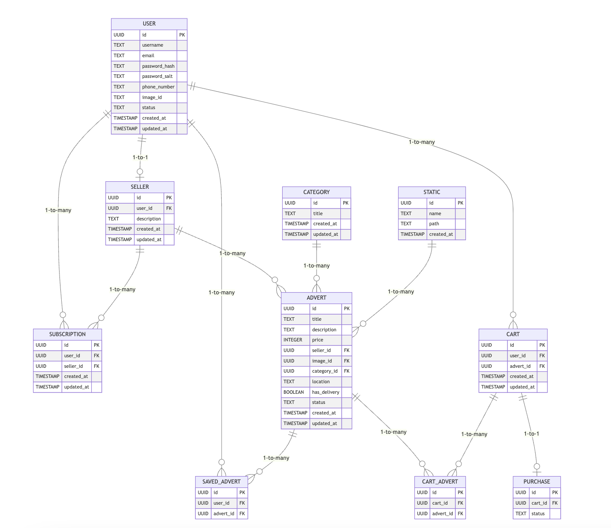

# Нормализация

### Таблица пользователя
Таблица, описывающая параметры сущности пользователя
```
Relation user:

{id} -> username, email, password_hash, password_salt, phone_number, image_id, status, created_at, updated_at

{email} -> id (уникальность)
```

Нормальные формы:
- 1НФ: Все атрибуты username, email, phone_number, password_hash, password_salt, image_id, status, created_at, updated_at атомарны, и у каждого пользователя есть уникальный идентификатор id.
- 2НФ: Все неключевые атрибуты зависят от всего первичного ключа id.
- 3НФ: Нет транзитивных зависимостей, все неключевые атрибуты зависят только от первичного ключа id.
- НФБК: 3НФ +  все функциональные зависимости имеют в левой части только суперключ id.

### Таблица продавца
Таблица, описывающая продавца
```
Relation seller:

{id} -> user_id, description, created_at, updated_at

{user_id} -> id (внешний ключ)
```

Нормальные формы:
- 1НФ: Все атрибуты атомарны, включая description, created_at и updated_at. Таблица имеет уникальный ключ {id}.
- 2НФ: Все неключевые атрибуты description, created_at, updated_at зависят от всего первичного ключа {id}.
- 3НФ: Нет транзитивных зависимостей, все неключевые атрибуты зависят только от первичного ключа {id}.
- НФБК: 3НФ + Все функциональные зависимости имеют суперключ {id} в левой части.

### Таблица подписки
Таблица, связывающая покупателя и продавца
```
Relation subscription:

{id} -> user_id, seller_id

{user_id, seller_id} -> id (уникальность)
```

Нормальные формы:
- 1НФ: Все атрибуты атомарны, и таблица имеет уникальный ключ {id}.
- 2НФ: Все неключевые атрибуты зависят от всего ключа {id}.
- 3НФ: Нет транзитивных зависимостей, все неключевые атрибуты зависят только от всего первичного ключа {id}.
- НФБК: 3НФ + Все функциональные зависимости имеют суперключ {id} в левой части.

### Таблица объявлений
Таблица, определяющая параметры объявления
```
Relation advert:

{id} -> title, description, price, seller_id, image_id, category_id, created_at, updated_at, location, has_delivery, status

{seller_id} -> id (внешний ключ)

{image_id} -> id (внешний ключ)

{category_id} -> id (внешний ключ)
```

Нормальные формы:
- 1НФ: Все атрибуты атомарны title, description, price и другие, и у каждого объявления есть уникальный идентификатор (id).
- 2НФ: Все неключевые атрибуты зависят от всего первичного ключа id.
- 3НФ: Нет транзитивных зависимостей, все неключевые атрибуты зависят только от первичного ключа id.
- НФБК: 3НФ + Все функциональные зависимости имеют суперключ id в левой части.

### Таблица сохраненных объявлений
Таблица объявления, добавленного в избранное пользователем
```
Relation saved_advert:

{id} -> user_id, advert_id, created_at

{user_id, advert_id} -> id (уникальность)

{user_id} -> id (внешний ключ)

{advert_id} -> id (внешний ключ)
```

Нормальные формы:
- 1НФ: Все атрибуты атомарны, включая created_at и updated_at, и таблица имеет уникальный ключ {id}.
- 2НФ: Все неключевые атрибуты created_at зависят от всего ключа {id}.
- 3НФ: Нет транзитивных зависимостей, все неключевые атрибуты зависят только от всего первичного ключа {id}.
- НФБК: 3НФ + Все функциональные зависимости имеют суперключ {id} в левой части.

### Таблица корзины
Таблица, создающая корзину для пользователя
```
Relation cart:

{id} -> user_id, status, created_at, updated_at

{user_id} -> id (внешний ключ)
```

Нормальные формы:
- 1НФ: Все атрибуты атомарны, включая created_at и updated_at. Таблица имеет уникальный ключ {id}.
- 2НФ: Все неключевые атрибуты created_at, updated_at зависят от всего  ключа {id}.
- 3НФ: Нет транзитивных зависимостей, все неключевые атрибуты зависят только от первичного ключа {id}.
- НФБК: 3НФ + Все функциональные зависимости имеют суперключ {id} в левой части.

### Таблица связи между корзиной и объявлениями
Таблица, связывающая корзину с объявлениями
```
Relation cart_advert:

{id} -> art_id, advert_id

{cart_id, advert_id} -> id (уникальность)

{advert_id} -> id (внешний ключ)

{advert_id} -> id (внешний ключ)
```

Нормальные формы:
- 1НФ: Все атрибуты атомарны, и таблица имеет первичный ключ {id}.
- 2НФ: Все неключевые атрибуты зависят от всего ключа {id}.
- 3НФ: Нет транзитивных зависимостей, все неключевые атрибуты зависят только от всего первичного ключа {id}.
- НФБК: 3НФ + Все функциональные зависимости имеют суперключ {id} в левой части.

### Таблица покупок
Таблица, описывающая статус и содержимое покупок
```
Relation purchase:

{id} -> cart_id, status, adress, payment_method, delivery_method, created_at, updated_at

{cart_id} -> id (внешний ключ)
```

Нормальные формы:
- 1НФ: Все атрибуты атомарны, включая status, created_at, updated_at. Таблица имеет уникальный ключ {id}.
- 2НФ: Все неключевые атрибуты status, created_at, updated_at зависят от всего ключа {id}.
- 3НФ: Нет транзитивных зависимостей, все неключевые атрибуты зависят только от всего первичного ключа {id}.
- НФБК: 3НФ + Все функциональные зависимости имеют суперключ {id} в левой части.

### Таблица категорий
Таблица, описывающая категории объявлений
```
Relation category:

{id} -> id → title, created_at
```

Нормальные формы:
- 1НФ: Все атрибуты атомарны, включая title, created_at. Таблица имеет уникальный ключ id.
- 2НФ: Все неключевые атрибуты title, created_at зависят от всего первичного ключа id.
- 3НФ: Нет транзитивных зависимостей, все неключевые атрибуты зависят только от первичного ключа id.
- НФБК: 3НФ + Все функциональные зависимости имеют суперключ id в левой части.

### Таблица для хранения статических файлов
```
Relation static:

{id} -> name, path, created_at
```
Нормальные формы:
- 1НФ: Все атрибуты атомарны, включая name, path, created_at. Таблица имеет уникальный ключ id.
- 2НФ: Все неключевые атрибуты (name, path, created_at) зависят от всего первичного ключа id.
- 3НФ: Нет транзитивных зависимостей, все неключевые атрибуты зависят только от первичного ключа id.
- НФБК: 3НФ + Все функциональные зависимости имеют суперключ id в левой части.


### ER диаграмма

